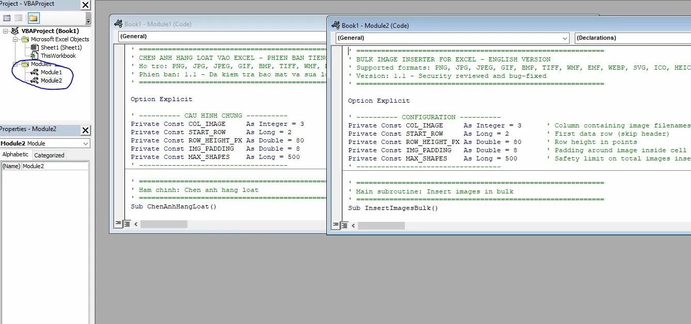
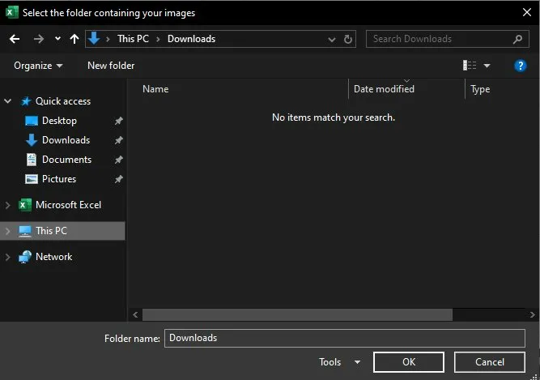
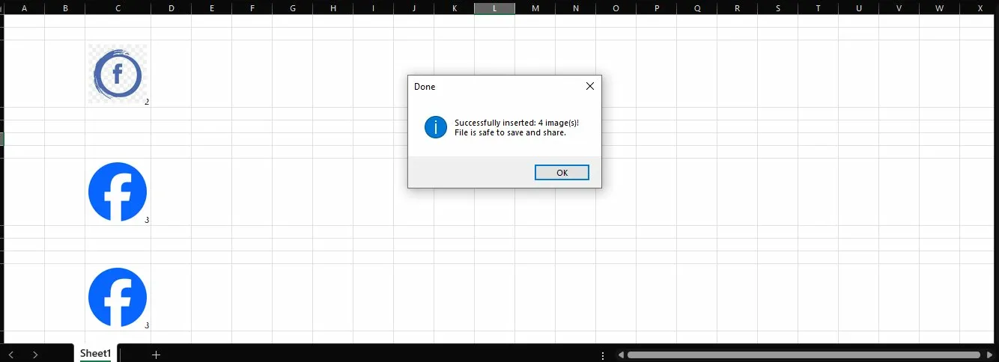
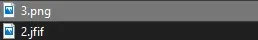

# 📸 Excel Bulk Image Inserter / Chèn Ảnh Hàng Loạt vào Excel

[](LICENSE)
[]()
[]()

---

## 🇬🇧 English

### Overview

A VBA macro that **automatically inserts images in bulk into Excel**: reads filenames from a column, searches for images in a folder you select, then places each image neatly inside its cell — maintaining aspect ratio, centered, no distortion.

Use cases: furniture quotations, product catalogs, inventory sheets, construction project files...

---

### ✅ Features

- Auto-inserts images based on filenames in column C (configurable)
- Supports 15 formats: **PNG, JPG, JPEG, JFIF, GIF, BMP, TIFF, WMF, EMF, WEBP, SVG, ICO, HEIC, HEIF**
- Smart image sizing: **preserves original aspect ratio**, centered in cell
- **Folder picker dialog** — no hardcoded paths in code
- Removes old images before inserting (prevents overlapping)
- Reports missing files after completion
- Safety limit: max 500 images per run
- Bulk delete macro with confirmation dialog

---

### 🛡️ Security

- **Path traversal protection**: filenames containing `../`, `/`, or `\` are rejected
- Images are **embedded** into the workbook (not linked externally) → safe to share
- No data written outside the selected folder
- No use of `Shell`, `WScript`, or any system commands

---

### 📋 Requirements

| Requirement | Details |
|---|---|
| OS | Windows 10/11 |
| Software | Microsoft Excel 2010 or later (Excel 2016+ recommended for full format support) |
| Macros | Must be **enabled** in Excel |

---

### 📂 What is a `.bas` file? How do I open it?

A `.bas` file is a VBA (Visual Basic for Applications) source file — **it cannot be run directly**, it must be imported into Excel first.

#### How to import into Excel:

**Option 1 — Import file (fastest):**
1. Open your Excel file
2. Press `Alt + F11` → open the Visual Basic Editor
3. Go to **File → Import File...**
4. Select the downloaded `.bas` file → click **Open**
5. Save your Excel file as **`.xlsm`** (Excel Macro-Enabled Workbook)

**Option 2 — Copy manually:**
1. Open the `.bas` file with **Notepad** (right-click → Open with → Notepad)
2. Press `Ctrl + A` → `Ctrl + C` to copy everything
3. Open Excel → press `Alt + F11`
4. Go to **Insert → Module**
5. Paste the code (`Ctrl + V`)
6. Save your Excel file as **`.xlsm`**

> **Why `.bas` instead of `.xlsm`?**
> A `.bas` file contains only plain source code — smaller, transparent, easy to review on GitHub, and won't trigger antivirus warnings like `.xlsm` files sometimes do.

---

### 🚀 How to Use

#### Step 1 — Prepare your Excel file

Create column **C** with **numeric** image filenames (numbers only, no extension):

| A | B | C |
|---|---|---|
| # | Product Name | **Image** |
| 1 | Office Desk | `1` |
| 2 | Swivel Chair | `2` |
| 3 | Bookshelf | `3` |

Your image files must be named accordingly: `1.png`, `2.jpg`, `3.heic`, etc.

> **Note**: Column C must contain plain numbers only. Text values like `desk_001` will be skipped.

#### Step 2 — Import the macro

1. Open your Excel file
2. Press `Alt + F11` → open the Visual Basic Editor
3. Go to **Insert → Module**
4. Paste the entire content of the `.bas` file
5. Press `Ctrl + S` → save as **xlsm** (Excel Macro-Enabled Workbook)


*Two modules imported: Vietnamese (Module1) and English (Module2)*

#### Step 3 — Run the macro

1. Press `Alt + F8`
2. Select `InsertImagesBulk` → click **Run**
3. A folder picker dialog will appear → select the folder containing your images



4. Wait for completion → review the summary message



> **Supported file types include `.jfif`** — common when saving images from Google:



#### Changing the image column

1. Press `Alt + F11` → open the Visual Basic Editor
2. In the left panel, find your file under **VBAProject** → double-click the module (e.g. `Module1`)
3. Find this line near the top of the code:
```vb
Private Const COL_IMAGE As Integer = 3   ' Column C
```
4. Change `3` to the desired column number — for example `4` for column D, `5` for column E
5. Press `Ctrl + S` to save

| Column | Number |
|---|---|
| A | 1 |
| B | 2 |
| C | 3 |
| D | 4 |
| E | 5 |

---

### ⚙️ Advanced Configuration

```vb
Private Const COL_IMAGE     As Integer = 3    ' Column with image filenames
Private Const START_ROW     As Long    = 2    ' First data row (skips header)
Private Const ROW_HEIGHT_PX As Double  = 80   ' Row height in points
Private Const IMG_PADDING   As Double  = 8    ' Padding around image in cell
Private Const MAX_SHAPES    As Long    = 500  ' Maximum images per run
```

---

### 📁 Project Structure

```
excel-vba-image-bulk-insert/
├── ChenAnhHangLoat_VI.bas   ← Vietnamese version
├── InsertImagesBulk_EN.bas  ← English version
├── README.md                ← This file
└── LICENSE                  ← MIT License
```

---

### ❓ Troubleshooting

| Issue | Cause | Fix |
|---|---|---|
| Macro won't run | Macros disabled | Click **Enable Content** on the yellow bar when opening the file. If no bar appears: File → Options → Trust Center → Macro Settings → Enable all macros |
| Windows 7 | Limited support | Works with Excel 2013+ only. PNG, JPG, BMP, GIF, TIFF, WMF, EMF are supported. WEBP, SVG, HEIC, HEIF, JFIF **not supported** (missing codecs) |
| Image not found | Filename mismatch | Ensure cell value matches actual filename (without extension) |
| HEIC/HEIF error | Missing codec | Install [Microsoft Store](https://apps.microsoft.com/store/detail/hevc-video-extensions/9NMZLZ57R3T7) or [K-Lite Codec Pack](https://codecguide.com/media_foundation_codecs.htm) |
| SVG not showing | Old Excel version | SVG requires Excel 2016+, WEBP requires Excel 2019+ or Microsoft 365 |
| File size very large | Too many large images | Compress images first, or use JPG instead of PNG |

---

### 📄 License

MIT License — free to use, modify, and share. See [LICENSE](LICENSE) for details.

---

---

## 🇻🇳 Tiếng Việt

### Giới thiệu

Macro VBA giúp bạn **chèn hàng loạt ảnh vào Excel** một cách tự động: đọc tên file từ một cột, tìm ảnh trong thư mục bạn chọn, rồi căn chỉnh ảnh gọn gàng vào từng ô — đúng tỉ lệ, căn giữa, không bị méo.

Phù hợp cho: báo giá nội thất, danh mục sản phẩm, bảng kiểm kê hàng hóa, hồ sơ dự án xây dựng...

---

### ✅ Tính năng

- Chèn ảnh tự động theo tên file trong cột C (có thể thay đổi)
- Hỗ trợ 15 định dạng: **PNG, JPG, JPEG, JFIF, GIF, BMP, TIFF, WMF, EMF, WEBP, SVG, ICO, HEIC, HEIF**
- Tự động căn chỉnh ảnh: **giữ tỉ lệ gốc**, căn giữa trong ô
- Hộp thoại **chọn thư mục** — không cần sửa đường dẫn trong code
- Xóa ảnh cũ trước khi chèn (tránh chồng ảnh)
- Báo cáo các file không tìm thấy sau khi chạy xong
- Giới hạn an toàn: tối đa 500 ảnh/lần chạy
- Macro xóa ảnh hàng loạt kèm xác nhận

---

### 🛡️ Bảo mật

- **Chống path traversal**: tên file chứa `../`, `/`, `\` sẽ bị từ chối
- Ảnh được **nhúng trực tiếp** vào file (không link ngoài) → an toàn khi gửi khách
- Không ghi dữ liệu ra ngoài thư mục được chọn
- Không dùng `Shell`, `WScript`, hay bất kỳ lệnh hệ thống nào

---

### 📋 Yêu cầu

| Yêu cầu | Chi tiết |
|---|---|
| Hệ điều hành | Windows 10/11 |
| Phần mềm | Microsoft Excel 2010 trở lên (Excel 2016+ để dùng đầy đủ định dạng) |
| Macro | Phải **bật Macro** trong Excel |

---

### 📂 File `.bas` là gì? Mở bằng cách nào?

File `.bas` là file mã nguồn VBA (Visual Basic for Applications) — **không chạy trực tiếp được**, phải import vào Excel trước.

#### Cách import vào Excel:

**Cách 1 — Import file (nhanh nhất):**
1. Mở file Excel của bạn
2. Nhấn `Alt + F11` → mở Visual Basic Editor
3. Vào menu **File → Import File...**
4. Chọn file `.bas` vừa tải về → nhấn **Open**
5. Lưu file Excel dưới dạng **`.xlsm`** (Excel Macro-Enabled Workbook)

**Cách 2 — Copy thủ công:**
1. Mở file `.bas` bằng **Notepad** (click phải → Open with → Notepad)
2. Nhấn `Ctrl + A` → `Ctrl + C` để copy toàn bộ
3. Mở Excel → nhấn `Alt + F11`
4. Vào menu **Insert → Module**
5. Dán code vào (`Ctrl + V`)
6. Lưu file Excel dưới dạng **`.xlsm`**

> **Tại sao dùng `.bas` thay vì `.xlsm`?**
> File `.bas` chỉ chứa code thuần — nhẹ hơn, minh bạch hơn, dễ xem trên GitHub, và không bị phần mềm diệt virus cảnh báo như file `.xlsm`.

---

### 🚀 Cách sử dụng

#### Bước 1 — Chuẩn bị file Excel

Tạo cột **C** chứa **số thứ tự** tương ứng với tên file ảnh (chỉ ghi số, không cần đuôi file):

| A | B | C |
|---|---|---|
| STT | Tên sản phẩm | **Ảnh** |
| 1 | Bàn làm việc | `1` |
| 2 | Ghế xoay | `2` |
| 3 | Kệ sách | `3` |

File ảnh trong thư mục phải đặt tên tương ứng: `1.png`, `2.jpg`, `3.heic`...

> **Lưu ý**: Cột C chỉ nhận giá trị số. Nếu ghi tên chữ như `ban_lv_001` sẽ bị bỏ qua.

#### Bước 2 — Nhập macro vào Excel

1. Mở file Excel
2. Nhấn `Alt + F11` → mở Visual Basic Editor
3. Vào menu **Insert → Module**
4. Dán toàn bộ nội dung file `.bas` vào
5. Nhấn `Ctrl + S` → lưu dưới dạng **xlsm** (Excel Macro-Enabled Workbook)


*Hai module đã import: tiếng Việt (Module1) và tiếng Anh (Module2)*

#### Bước 3 — Chạy macro

1. Nhấn `Alt + F8`
2. Chọn `ChenAnhHangLoat` → nhấn **Run**
3. Hộp thoại xuất hiện → chọn thư mục chứa ảnh


4. Chờ macro chạy xong → xem thông báo kết quả


> **Hỗ trợ file `.jfif`** — định dạng phổ biến khi lưu ảnh từ Google:


#### Cách thay đổi cột ảnh

1. Nhấn `Alt + F11` → mở Visual Basic Editor
2. Ở panel bên trái, tìm file của bạn trong **VBAProject** → double-click vào module (ví dụ `Module1`)
3. Tìm dòng này ở đầu code:
```vb
Private Const COL_IMAGE As Integer = 3   ' Cột C
```
4. Đổi `3` thành số cột mong muốn — ví dụ `4` cho cột D, `5` cho cột E
5. Nhấn `Ctrl + S` để lưu

| Cột | Số |
|---|---|
| A | 1 |
| B | 2 |
| C | 3 |
| D | 4 |
| E | 5 |

---

### ⚙️ Cấu hình nâng cao

```vb
Private Const COL_IMAGE     As Integer = 3    ' Cột chứa tên file ảnh
Private Const START_ROW     As Long    = 2    ' Hàng bắt đầu (bỏ qua header)
Private Const ROW_HEIGHT_PX As Double  = 80   ' Chiều cao hàng (points)
Private Const IMG_PADDING   As Double  = 8    ' Khoảng trắng xung quanh ảnh
Private Const MAX_SHAPES    As Long    = 500  ' Giới hạn số ảnh tối đa
```

---

### 📁 Cấu trúc dự án

```
excel-vba-image-bulk-insert/
├── ChenAnhHangLoat_VI.bas   ← Phiên bản tiếng Việt
├── InsertImagesBulk_EN.bas  ← Phiên bản tiếng Anh
├── README.md                ← Hướng dẫn này
└── LICENSE                  ← Giấy phép MIT
```

---

### ❓ Xử lý sự cố thường gặp

| Vấn đề | Nguyên nhân | Giải pháp |
|---|---|---|
| Macro không chạy | Macro bị tắt | Nhấn **Enable Content** trên thanh vàng khi mở file. Nếu không thấy thanh vàng: File → Options → Trust Center → Macro Settings → Enable all macros |
| Windows 7 | Hỗ trợ giới hạn | Cần Excel 2013 trở lên. PNG, JPG, BMP, GIF, TIFF, WMF, EMF dùng được bình thường. WEBP, SVG, HEIC, HEIF, JFIF **không hỗ trợ** do thiếu codec |
| Không tìm thấy ảnh | Sai tên file hoặc sai thư mục | Kiểm tra tên file trong ô Excel khớp với tên file thực tế |
| Lỗi HEIC/HEIF | Thiếu codec | Cài [Microsoft Store](https://apps.microsoft.com/store/detail/hevc-video-extensions/9NMZLZ57R3T7) hoặc [K-Lite Codec Pack](https://codecguide.com/media_foundation_codecs.htm) |
| SVG không hiện | Excel cũ | SVG cần Excel 2016+, WEBP cần Excel 2019+ hoặc Microsoft 365 |
| File nặng bất thường | Quá nhiều ảnh lớn | Nén ảnh trước khi chèn, hoặc dùng JPG thay PNG |

---

### 📄 Giấy phép

MIT License — miễn phí sử dụng, chỉnh sửa và chia sẻ. Xem [LICENSE](LICENSE) để biết thêm chi tiết.
